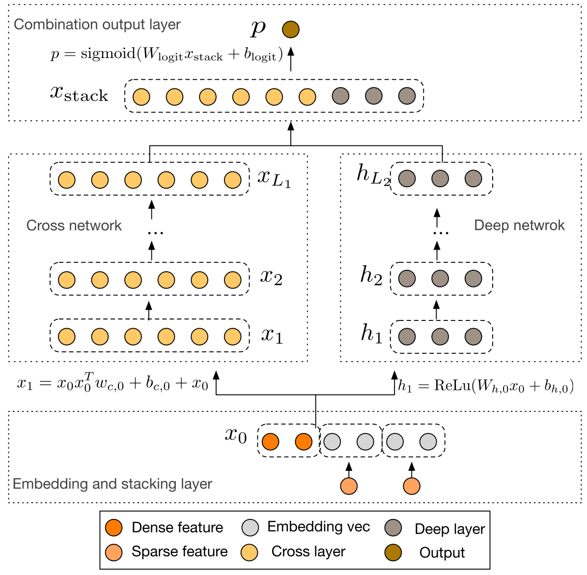

# 深度交叉网络（Deep & Cross Network，DCN）

DCN（Deep & Cross Network）是 Google 于 2017 年提出的推荐模型，发表于 AdKDD 2017，论文题为 *Deep & Cross Network for Ad Click Predictions* [1]。

DCN 的核心思想是通过 **Cross Network 显式学习有界阶数的特征交叉**，同时利用 **Deep Network** 学习复杂的非线性特征关系，将两者结合用于点击率（CTR）预测。

## 1. 背景（Background）

特征交叉是 CTR 预测中的重要技术。传统线性模型通常依赖人工构造交叉特征，例如用户性别与商品类别的组合；深度神经网络（DNN）虽然能够自动学习非线性关系，但其特征交互是隐式建模的，不一定能够高效学习特定的交叉关系。

DCN 针对这一问题引入 Cross Network，通过特定的交叉层结构自动学习显式的高阶特征组合，并与 DNN 并行建模，从而减少人工特征工程，同时增强模型对特征交互的表达能力。

## 2. 模型架构（Model Architecture）

### 2.1 整体网络结构

DCN 的整体模型架构如下图所示。



> 图 1：原始 DCN 的并行结构示意图（依据原论文 [1] 重新绘制）。

DCN 由四个部分组成：

- **Embedding & Stacking Layer**：将稀疏类别特征转换为 Embedding，并与数值特征拼接，形成统一输入。
- **Cross Network**：显式建模有界阶数的特征交互。
- **Deep Network**：利用多层全连接网络学习非线性特征关系。
- **Combination Layer**：拼接两个分支的输出，生成最终预测结果。

原始 DCN 采用并行结构，Cross Network 和 Deep Network 接收相同的输入，分别学习不同类型的特征关系，最后融合用于预测。

### 2.2 输入层（Embedding & Stacking Layer）

推荐场景中的输入通常包含稀疏类别特征（用户 ID、商品 ID、类别等）和稠密数值特征（价格、统计次数等）。类别特征先通过 Embedding 映射成稠密向量：

$$
e_i = \operatorname{Embedding}(x_i)
$$

再将这些向量与归一化后的数值特征拼接：

$$
x_0 = [e_1;e_2;\cdots;e_k;x_{\mathrm{dense}}] \in \mathbb{R}^d
$$

其中 $e_i$ 为类别特征的向量表示，$x_{\mathrm{dense}}$ 为数值特征，$x_0$ 是 Cross Network 和 Deep Network 的共同输入。

### 2.3 交叉网络（Cross Network）

Cross Network 是 DCN 的核心，其目标是通过显式交叉构建高阶组合特征。

**（1）Cross Layer 计算**

对于第 $l$ 层，原始 DCN 定义 [1]：

$$
\boxed{x_{l+1}=x_0(x_l^T w_l)+b_l+x_l}
$$

其中 $x_0,x_l,x_{l+1}\in\mathbb{R}^d$，$w_l,b_l\in\mathbb{R}^d$。该公式包含三部分：

- $x_0(x_l^T w_l)$：原始输入与当前层表示的显式交叉；
- $b_l$：偏置向量；
- $x_l$：残差连接，用于保留已有表示。

首先通过 $x_l^T w_l$ 计算一个标量，再将其乘以原始输入 $x_0$，最后加上偏置和残差。

**（2）高阶特征交叉**

为简化推导，暂时忽略偏置，令 $x_0=[a,b]^T$，$w_0=[w_1,w_2]^T$。第一层为：

$$
x_1=x_0(x_0^T w_0)+x_0
=\begin{bmatrix}a^2w_1+abw_2+a\\abw_1+b^2w_2+b\end{bmatrix}
$$

可见，一层 Cross Layer 就能够产生 $a^2$、$ab$、$b^2$ 等二阶交互。继续叠加可以产生 $a^3$、$a^2b$、$ab^2$、$b^3$ 等更高阶项。

对于 $L$ 层 Cross Network，输出关于原始输入的**多项式最高次数为 $L+1$**。但需要注意：Cross Network 不是给每个交叉项分配独立参数，而是通过共享参数生成这些交互，因此表达形式受到结构约束。

**（3）参数量与复杂度**

每层只包含长度为 $d$ 的权重向量与偏置向量，因此其参数量为 $2d$。$L$ 层 Cross Network 的参数量为：

$$
\boxed{2dL}
$$

单个样本在每一层的主要计算是向量内积及逐元素运算，复杂度为 $O(d)$；整个 Cross Network 为 $O(Ld)$（不含输入 Embedding 计算）。

### 2.4 深度网络（Deep Network）

Cross Network 负责显式特征交叉，而 Deep Network 通过多层非线性变换学习更灵活的隐式交互关系：

$$
h_{l+1}=\sigma(W_lh_l+b_l),\qquad h_0=x_0
$$

其中 $W_l$ 和 $b_l$ 是可学习参数，$\sigma$ 通常为 ReLU。Deep Network 最终得到 $h_{L_d}$。

| 对比维度 | Cross Network | Deep Network |
| --- | --- | --- |
| 主要作用 | 显式特征交叉 | 隐式非线性建模 |
| 核心计算 | 向量内积及交叉运算 | 全连接层与激活函数 |
| 交叉阶数 | 多项式最高阶受层数控制 | 无对应的显式阶数界定 |
| 参数量 | 随 $d$ 和层数线性增长 | 取决于层宽与深度 |

### 2.5 融合层（Combination Layer）

Cross Network 的输出为 $x_{L_c}\in\mathbb{R}^{d}$，Deep Network 的输出为 $h_{L_d}\in\mathbb{R}^{m}$。拼接两个分支：

$$
z=[x_{L_c};h_{L_d}]
$$

再经过线性层与 Sigmoid，得到点击率预测：

$$
\boxed{\hat y=\sigma(w^Tz+b)},\qquad \sigma(t)=\frac{1}{1+e^{-t}}
$$

### 2.6 损失函数（Loss Function）

对于 CTR 二分类任务，采用二元交叉熵（BCE）：

$$
\mathcal{L}_{\mathrm{BCE}}=-\frac{1}{N}\sum_{i=1}^{N}\left[y_i\log\hat y_i+(1-y_i)\log(1-\hat y_i)\right]
$$

其中 $y_i\in\{0,1\}$ 为真实点击标签，$\hat y_i$ 为预测概率。还可以加入 L2 正则化：

$$
\mathcal{L}=\mathcal{L}_{\mathrm{BCE}}+\lambda\sum_{\theta\in\Theta_{\mathrm{reg}}}\|\theta\|_2^2
$$

## 3. 模型实现（Implementation）

### 3.1 核心代码实现

下面使用 PyTorch 实现原始 DCN 的 Cross Network、Deep Network 和融合层。假设输入已经完成 Embedding 编码和拼接。

**（1）Cross Network**

```python
import torch
import torch.nn as nn


class CrossNetwork(nn.Module):
    def __init__(self, input_dim, num_layers=3):
        super().__init__()
        self.weights = nn.ParameterList([
            nn.Parameter(torch.empty(input_dim))
            for _ in range(num_layers)
        ])
        self.biases = nn.ParameterList([
            nn.Parameter(torch.zeros(input_dim))
            for _ in range(num_layers)
        ])
        for weight in self.weights:
            nn.init.normal_(weight, std=0.01)

    def forward(self, x):
        x0 = x
        xl = x
        for weight, bias in zip(self.weights, self.biases):
            interaction = torch.sum(
                xl * weight, dim=1, keepdim=True
            )  # [B, 1]
            xl = x0 * interaction + bias + xl  # [B, D]
        return xl
```

核心计算 `xl = x0 * interaction + bias + xl` 与公式 $x_{l+1}=x_0(x_l^Tw_l)+b_l+x_l$ 一一对应。

**（2）DCN 模型**

```python
class DCN(nn.Module):
    def __init__(
        self, input_dim,
        num_cross_layers=3,
        deep_dims=(128, 64)
    ):
        super().__init__()
        self.cross_network = CrossNetwork(
            input_dim, num_cross_layers
        )

        layers = []
        prev_dim = input_dim
        for hidden_dim in deep_dims:
            layers.extend([
                nn.Linear(prev_dim, hidden_dim),
                nn.ReLU()
            ])
            prev_dim = hidden_dim
        self.deep_network = nn.Sequential(*layers)

        self.output_layer = nn.Linear(
            input_dim + prev_dim, 1
        )

    def forward(self, x):
        cross_output = self.cross_network(x)
        deep_output = self.deep_network(x)
        combined = torch.cat(
            [cross_output, deep_output], dim=-1
        )
        logits = self.output_layer(combined)
        return logits.squeeze(-1)
```

`forward` 输出 Logits 而不是概率，以便训练时使用数值更稳定的 `BCEWithLogitsLoss`。

**（3）前向预测与训练示例**

```python
torch.manual_seed(42)
model = DCN(
    input_dim=64,
    num_cross_layers=3,
    deep_dims=(128, 64)
)

x = torch.randn(8, 64)
labels = torch.randint(0, 2, (8,)).float()

logits = model(x)               # [8]
probabilities = torch.sigmoid(logits)

criterion = nn.BCEWithLogitsLoss()
optimizer = torch.optim.Adam(model.parameters(), lr=0.001)

loss = criterion(logits, labels)
optimizer.zero_grad()
loss.backward()
optimizer.step()

print('Prediction shape:', probabilities.shape)
print('Loss:', loss.item())
```

示例数据仅用于演示前向传播与反向传播；真实 CTR 场景还需要特征编码、数据划分，以及 AUC、LogLoss 等评估指标。

## 4. 总结（Conclusion）

DCN 通过 Cross Network 高效建模显式的有界阶数特征交叉，并借助并行 Deep Network 学习复杂的非线性关系。其核心创新是使用参数量较小的 Cross Layer 自动构造高阶交互，从而降低对人工交叉特征工程的依赖。

原始 DCN 的向量式交叉层虽然高效，但表达能力受参数化方式限制。后续的 **DCN V2** 将交叉层扩展为矩阵形式，并引入低秩分解等改进，提高了复杂特征交互的建模能力 [2]。

## 5. 参考文献（References）

[1] Wang R, Fu B, Fu G, Wang M. **Deep & Cross Network for Ad Click Predictions**. AdKDD, 2017. https://arxiv.org/abs/1708.05123

[2] Wang R, Shivanna R, Cheng D, et al. **DCN V2: Improved Deep & Cross Network and Practical Lessons for Web-scale Learning to Rank Systems**. WWW, 2021. https://arxiv.org/abs/2008.13535

[3] Cheng H T, Koc L, Harmsen J, et al. **Wide & Deep Learning for Recommender Systems**. DLRS, 2016. https://arxiv.org/abs/1606.07792

[4] Google. **Ranking with Deep & Cross Networks**. TensorFlow Recommenders. https://www.tensorflow.org/recommenders/examples/dcn

[5] PyTorch. **PyTorch Documentation**. https://docs.pytorch.org/docs/stable/index.html
