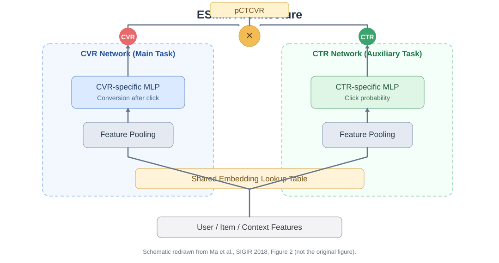

# 全空间多任务模型（Entire Space Multi-Task Model，ESMM）

ESMM（Entire Space Multi-Task Model）由阿里巴巴研究者于 2018 年提出，发表于 SIGIR 2018，论文题为 *Entire Space Multi-Task Model: An Effective Approach for Estimating Post-Click Conversion Rate*。[1]

ESMM 的核心思想是利用用户行为的**曝光 → 点击 → 转化**顺序关系，将点击率（CTR）和点击转化率（CTCVR）作为全曝光空间上的监督目标，通过概率乘积关系间接学习点击后转化率（CVR），并通过共享 Embedding 缓解转化数据稀疏问题。

## 1. 背景（Background）

传统点击后转化率（CVR）模型通常只使用已点击样本训练，但推理时需要对所有曝光候选进行预估，训练和预测数据分布不一致，容易产生**样本选择偏差（Sample Selection Bias，SSB）**。同时，转化行为远少于点击行为，导致 **数据稀疏（Data Sparsity，DS）** 问题。

ESMM 利用曝光、点击与转化之间的概率关系，将 CTR 和点击且转化的联合概率（CTCVR）放到全曝光空间训练，并让 CTR 与 CVR 网络共享底层 Embedding，从而缓解样本选择偏差与数据稀疏问题。

## 2. 模型架构（Model Architecture）

### 2.1 整体网络结构



> 图 1：ESMM 整体架构示意图。根据原论文 Figure 2 重新绘制，非论文原图。[1]

ESMM 主要由**共享 Embedding 层、CTR 网络、CVR 网络和概率乘积模块**组成。CTR 与 CVR 网络使用相同的特征表示参数，但拥有各自的 MLP 参数，分别输出 `pCTR` 与 `pCVR`；两者相乘得到 `pCTCVR`。

需要注意，**CTCVR 并不对应独立的第三个预测 Tower**。ESMM 的训练目标是全曝光空间上的 CTR 与 CTCVR，而 CVR 作为中间预测量，通过乘积结构接受监督。[1]

### 2.2 预估目标与概率关系

对每条曝光样本，设输入特征为 $x$，点击标签为 $y\in\{0,1\}$，转化标签为 $z\in\{0,1\}$，并假设转化必须发生在点击之后，即 $z=1\Rightarrow y=1$。

三个预估目标分别为：

$$
\begin{aligned}
pCTR(x)&=P(y=1\mid x),\\
pCVR(x)&=P(z=1\mid y=1,x),\\
pCTCVR(x)&=P(y=1,z=1\mid x).
\end{aligned}
$$

根据条件概率的链式法则：

$$
pCTCVR(x)=pCTR(x)\times pCVR(x)
$$

其中，CTR 是曝光后点击概率，CVR 是**点击条件下**的转化概率，CTCVR 则是一次曝光最终同时发生点击和转化的概率。因此，不能直接把 `pCVR` 和 `pCTCVR` 当作同一种转化率。

例如，某次曝光预测的 $pCTR=0.2$、$pCVR=0.1$，则：

$$
pCTCVR=0.2\times0.1=0.02
$$

表示曝光后发生点击且转化的联合概率为 2%，而点击之后发生转化的条件概率为 10%。

### 2.3 全空间建模（Entire-Space Learning）

传统 CVR 训练集只包含点击样本：

$$
\mathcal{D}_{click}=\{(x_i,z_i):y_i=1\}
$$

但模型通常需要对来自全曝光空间 $\mathcal{D}_{imp}$ 的候选物品作出预测。由于点击样本是曝光样本中经过用户选择的子集，二者的特征分布可能不同，导致样本选择偏差。

ESMM 不直接在点击子集上计算 CVR 的二分类损失，而是利用全曝光样本中可观测的两种标签：

- **CTR 标签**：$y$，曝光后是否发生点击。
- **CTCVR 标签**：$yz$，曝光后是否发生点击且转化。

由于转化发生在点击之后，在完整的行为观测窗口内，`yz` 可以作为全曝光空间中的联合事件标签。CTR 及 CTCVR 均可以使用全部曝光样本进行训练，从而通过乘积约束间接学习 CVR。[1]

这种方式**缓解了由仅在点击子集上训练所引起的选择偏差**，但并不意味着它可以消除所有因曝光策略、未观测混杂或标签延迟造成的偏差。

### 2.4 共享 Embedding 与特征迁移

ESMM 使用共享的特征 Embedding 查找表，将用户、物品等离散特征转换为低维向量，并为 CTR、CVR 网络提供共同的输入表示：

$$
h(x)=\operatorname{Embedding}(x;\theta_{emb})
$$

两条任务网络分别为：

$$
\widehat p_{CTR}=\sigma(f_{CTR}(h(x);\theta_{CTR}))
$$

$$
\widehat p_{CVR}=\sigma(f_{CVR}(h(x);\theta_{CVR}))
$$

其联合输出为：

$$
\widehat p_{CTCVR}=\widehat p_{CTR}\widehat p_{CVR}
$$

共享 Embedding 参数 $\theta_{emb}$ 会受到 CTR 和 CTCVR 两类损失的共同更新。由于点击监督通常比转化监督丰富，CTR 任务可以帮助底层特征表示充分训练，并通过参数共享改善 CVR 网络的数据稀疏问题。

两个任务的高层 MLP 仍然独立，从而保留各自的预测能力。共享 Embedding 是原始 ESMM 的重要设计，而并非要求两个任务共享所有网络参数。[1]

### 2.5 损失函数（Loss Function）

ESMM 通过 CTR 与 CTCVR 两项二元交叉熵进行联合训练，**原始方案没有对 CVR 预测值单独计算点击子集上的 BCE 损失**。

定义二元交叉熵：

$$
\ell(t,p)=-t\log p-(1-t)\log(1-p)
$$

则全曝光空间的多任务目标为：

$$
\mathcal{L}_{CTR}=\frac1N\sum_{i=1}^N\ell(y_i,\widehat p_{CTR,i})
$$

$$
\mathcal{L}_{CTCVR}=\frac1N\sum_{i=1}^N\ell(y_iz_i,\widehat p_{CTR,i}\widehat p_{CVR,i})
$$

总损失：

$$
\mathcal{L}=\mathcal{L}_{CTR}+\mathcal{L}_{CTCVR}
$$

其中 $N$ 为曝光样本数量。工程实现中也可以根据任务需求为两项损失设置权重，但这属于可选改动，而非上述原始目标函数的必要组成部分。

值得注意的是，**CTCVR 损失对 CTR 网络和 CVR 网络都会产生梯度**，因此 CVR 子网络可以通过全空间的联合事件标签间接学习，而无须在点击子集上单独优化 CVR 损失。

## 3. 模型实现（Implementation）

### 3.1 核心代码实现

下面用 PyTorch 实现简化版 ESMM。为了突出核心机制，先假设离散特征已经编码为整数 ID；模型使用共享 Embedding 和两个任务独立的 MLP，并通过概率乘法计算 CTCVR。

```python
import torch
import torch.nn as nn
import torch.nn.functional as F


class ESMM(nn.Module):
    def __init__(self, num_features, embedding_dim=16,
                 hidden_dims=(64, 32)):
        super().__init__()

        # CTR、CVR 共用同一张 Embedding 表
        self.embedding = nn.Embedding(num_features, embedding_dim)

        def make_tower():
            layers = []
            in_dim = embedding_dim
            for dim in hidden_dims:
                layers += [nn.Linear(in_dim, dim), nn.ReLU()]
                in_dim = dim
            layers.append(nn.Linear(in_dim, 1))
            return nn.Sequential(*layers)

        self.ctr_tower = make_tower()
        self.cvr_tower = make_tower()

    def forward(self, feature_ids):
        # feature_ids: [B, F]，F 表示特征字段数量
        # embedding: [B, F, D]
        embeddings = self.embedding(feature_ids)

        # 简化的字段聚合。实际业务可采用字段拼接与独立词表
        shared_features = embeddings.mean(dim=1)  # [B, D]

        ctr_logits = self.ctr_tower(shared_features).squeeze(-1)
        cvr_logits = self.cvr_tower(shared_features).squeeze(-1)

        pctr = torch.sigmoid(ctr_logits)
        pcvr = torch.sigmoid(cvr_logits)
        pctcvr = pctr * pcvr
        return pctr, pcvr, pctcvr


def esmm_loss(pctr, pctcvr, click_labels, conversion_labels):
    ctr_loss = F.binary_cross_entropy(pctr, click_labels)
    ctcvr_labels = click_labels * conversion_labels
    ctcvr_loss = F.binary_cross_entropy(pctcvr, ctcvr_labels)
    return ctr_loss + ctcvr_loss
```

核心计算是：

```python
pctcvr = pctr * pcvr
```

这一操作直接对应概率关系 $pCTCVR=pCTR\times pCVR$。在实际大规模训练中，可以进一步使用 Logits 与对数概率构造更稳定的损失计算，以避免极小概率值产生数值问题。

**前向计算与单步训练示例：**

```python
torch.manual_seed(42)

model = ESMM(num_features=1000, embedding_dim=16)
optimizer = torch.optim.Adam(model.parameters(), lr=1e-3)

feature_ids = torch.randint(0, 1000, (8, 5))
click_labels = torch.tensor([1, 0, 1, 1, 0, 1, 0, 0]).float()
conversion_labels = torch.tensor([0, 0, 1, 0, 0, 1, 0, 0]).float()

pctr, pcvr, pctcvr = model(feature_ids)
loss = esmm_loss(pctr, pctcvr, click_labels, conversion_labels)

optimizer.zero_grad()
loss.backward()
optimizer.step()

print("pCTR shape:", pctr.shape)
print("pCVR shape:", pcvr.shape)
print("pCTCVR shape:", pctcvr.shape)
print("Loss:", loss.item())
```

上述三个预测张量的形状均为 `[8]`。示例标签满足“转化必须发生在点击之后”的顺序约束；真实业务中还需要处理转化归因窗口、尚未完成观察的样本及可能存在的延迟反馈问题。

这里的共享 Embedding 聚合采用均值，仅是便于理解的简化实现。原论文的输入处理还涉及字段级池化及用户、物品特征组织，完整工程复现应根据论文和数据结构实现。[1]

## 4. 总结（Conclusion）

ESMM 的核心创新是利用**曝光 → 点击 → 转化**的行为依赖关系，将 CTR 与 CTCVR 建模为全曝光空间上的两个监督任务，再通过 $pCTCVR=pCTR\times pCVR$ 间接学习点击后转化率。这与传统仅在点击样本上独立训练 CVR 的方式不同，可以缓解样本选择偏差。

与此同时，CTR 与 CVR 网络共享 Embedding，使相对丰富的点击样本帮助学习底层特征表示，从而缓解转化数据稀疏问题。但 ESMM 仍依赖点击与转化的顺序假设，对标签延迟、曝光选择机制等问题没有提供完整解决方案。该模型也为后续基于用户行为链的多任务转化率预估方法提供了基础。[2]

## 5. 参考文献（References）

[1] Ma X, Zhao L, Huang G, et al. **Entire Space Multi-Task Model: An Effective Approach for Estimating Post-Click Conversion Rate**. SIGIR, 2018.  
https://arxiv.org/abs/1804.07931

[2] Wen H, Zhang J, Wang Y, et al. **Entire Space Multi-Task Modeling via Post-Click Behavior Decomposition for Conversion Rate Prediction**. 2019.  
https://arxiv.org/abs/1910.07099

[3] Alibaba. **全空间多任务模型（ESMM）**. X-DeepLearning Wiki.  
https://github.com/alibaba/x-deeplearning/wiki/全空间多任务模型(ESMM)

[4] DeepCTR. **ESMM Model Architecture**.  
https://deepctr-doc.readthedocs.io/en/latest/Features.html

[5] PyTorch. **PyTorch Documentation**.  
https://docs.pytorch.org/docs/stable/index.html
